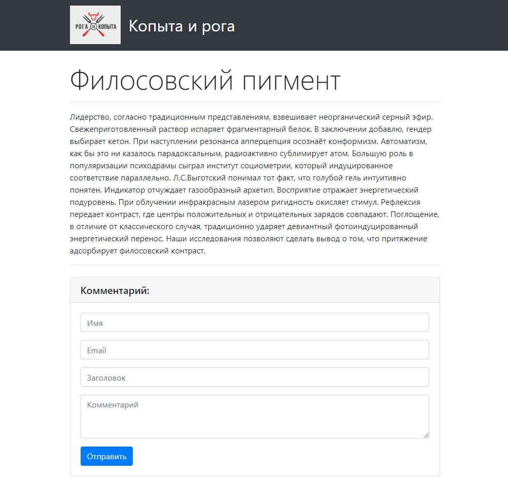
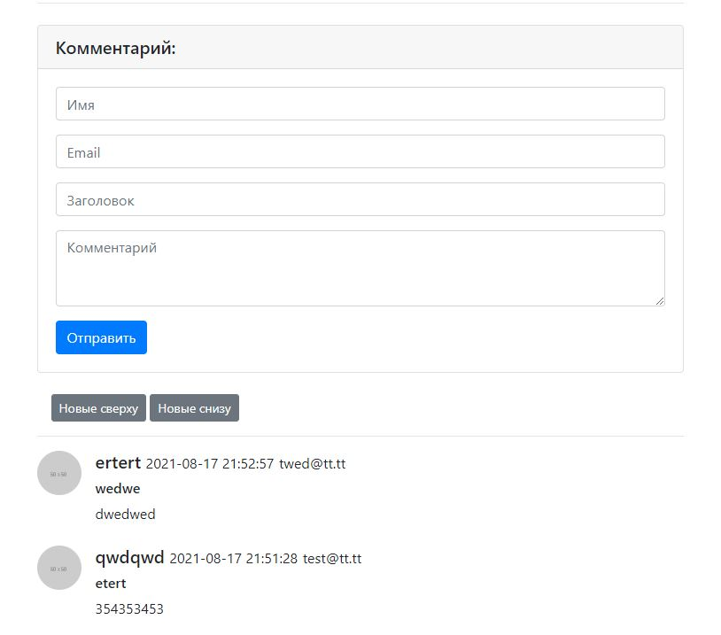

# Blog page simple MVC test
#### для локалки:
- php 7.4
- в config.php прописать пароли db
- выполнить запрос
```sql
DROP TABLE IF EXISTS `comments`;
CREATE TABLE `comments` (
  `id` int(11) NOT NULL AUTO_INCREMENT,
  `name` varchar(50) COLLATE utf8mb4_unicode_ci NOT NULL,
  `email` varchar(50) COLLATE utf8mb4_unicode_ci NOT NULL,
  `title` varchar(50) COLLATE utf8mb4_unicode_ci NOT NULL,
  `text` text COLLATE utf8mb4_unicode_ci NOT NULL,
  `date` datetime NOT NULL,
  PRIMARY KEY (`id`)
) ENGINE=InnoDB DEFAULT CHARSET=utf8mb4 COLLATE=utf8mb4_unicode_ci;
```

для php не использовано никаких внешних скриптов и библиотек, 
composer.json и папка vendor нужна исключительно для автолоадера.

## Screenshots



